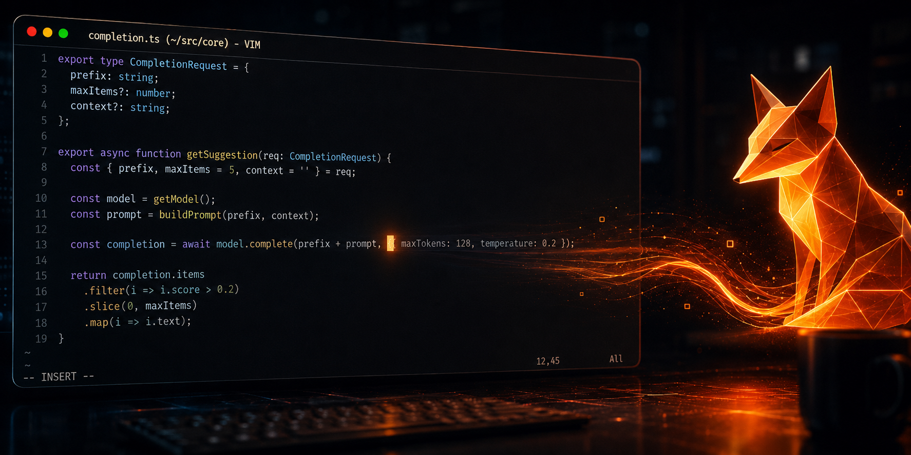

<h1 align="center">lecodestral.vim</h1>

<p align="center">
  <em>Copilot-style inline ghost-text autocomplete for <strong>classic Vim 9</strong>,<br/>
  powered by DeepSeek FIM (beta).</em>
</p>

<p align="center">
  
  
  
  
</p>

<p align="center">
  
</p>

<p align="center">
  <em>No Neovim. No Node. Native <code>+textprop</code> virtual text + async <code>+job</code> — nothing but <code>curl</code>.</em>
</p>

> [!NOTE]
> **Looking for a fully local, no-API-key alternative?** Check out the sister project
> **[leollama.vim](https://github.com/fmflurry/leollama.vim)** — same Vim ghost-text
> autocomplete, but powered entirely by a **local [Ollama](https://ollama.com) + Qwen**
> model. No subscription, no API key, no hidden fees — everything runs on your machine.

## Features

- Grey inline ghost text after the cursor, Copilot-style
- True **fill-in-the-middle**: sends code before *and* after the cursor
- Fully async (`job_start` + `curl`), debounced, cancels stale requests
- Multi-line suggestions (inline first line + virtual lines below)
- `<Tab>` falls through to a real tab / popup-menu nav when no ghost is shown
- Zero dependencies beyond `curl`

## Requirements

- Vim **9.0.0067+** compiled with `+textprop` and `+job` (`:echo has('patch-9.0.0067')`)
- `curl` on `$PATH`
- A DeepSeek API key from https://platform.deepseek.com

## Install

### vim-plug

```vim
Plug 'fmflurry/lecodestral.vim'
```

Then `:PlugInstall`.

### Native packages (no plugin manager)

```bash
git clone https://github.com/fmflurry/lecodestral.vim \
  ~/.vim/pack/plugins/start/lecodestral.vim
```

## Setup

Export your key (add to your shell rc):

```bash
export DEEPSEEK_API_KEY="your-key-here"
```

Launch Vim from a shell where that variable is set.

## Usage

| Action            | Default              |
| ----------------- | -------------------- |
| Trigger           | type in insert mode  |
| Accept suggestion | `<Tab>`              |
| Dismiss           | `<C-]>`              |
| Toggle on/off     | `:LeCodestralToggle` |
| Clear current     | `:LeCodestralDismiss`|

## Configuration

Set before the plugin loads (e.g. in your vimrc). Defaults shown:

```vim
let g:lecodestral_enabled     = v:true
let g:lecodestral_model       = 'deepseek-v4-flash'
let g:lecodestral_debounce_ms = 50
let g:lecodestral_max_tokens  = 256
let g:lecodestral_max_lines   = 3
let g:lecodestral_max_prefix  = 8000
let g:lecodestral_max_suffix  = 4000
let g:lecodestral_temperature = 0.2
let g:lecodestral_stop        = ["\n\n\n"]
let g:lecodestral_accept_key  = '<Tab>'
let g:lecodestral_api_key_env = 'DEEPSEEK_API_KEY'
let g:lecodestral_endpoint    = 'https://api.deepseek.com/beta/completions'
```

Ghost text uses the `LeCodestralGhost` highlight group (links to `Comment` by default):

```vim
highlight LeCodestralGhost ctermfg=245 guifg=#6c7086
```

## Notes & limitations

- FIM = fill-in-the-middle: `prompt` = text before cursor, `suffix` = text after,
  so completions are context-aware mid-file.
- DeepSeek FIM max completion length is 4096 tokens; the plugin clamps to it.
- DeepSeek FIM `stop` parameter accepts at most 16 sequences; longer lists are truncated.
- Concurrency limits: 2500 for `deepseek-v4-flash`, 500 for `deepseek-v4-pro`. HTTP 429 on overflow; under load the API may return empty lines instead.
- No streaming yet — one request per debounce window.

## License

[MIT](LICENSE)
